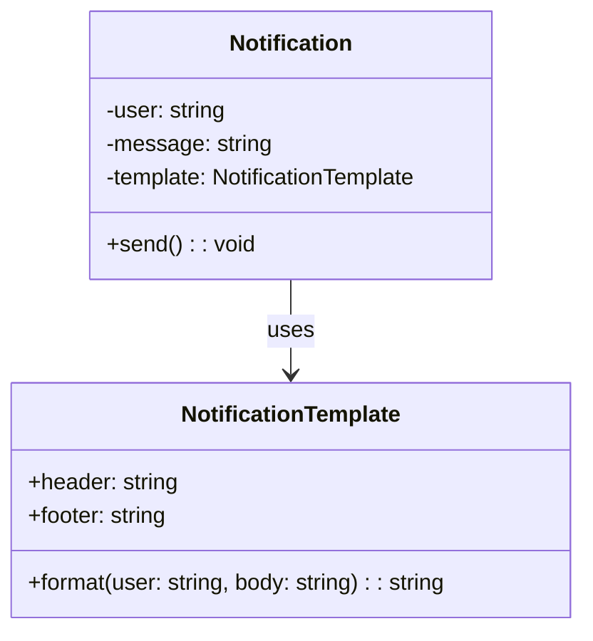

import Tabs from "@theme/Tabs";
import TabItem from "@theme/TabItem";
import CodeBlock from "@theme/CodeBlock";

import tsCode from "@site/src/codes/hardcoded-variability/ts/rfc_flyweight.ts";
import phpCode from "@site/src/codes/hardcoded-variability/php/rfc_flyweight.php";
import pyCode from "@site/src/codes/hardcoded-variability/py/rfc_flyweight.py";

# 🧩 Flyweight パターン

## ✅ 設計意図

- 同じデータやロジックを持つオブジェクトを**共有**して、必要な情報だけ**外部化**して保持する
- **大量の似たようなインスタンス**を最小限の構造で扱う

## ✅ 適用理由

- UI 構成、ステータス表示、ラベル、ボタンなど、**表示内容が異なるだけの処理を共通化**
- 一部だけ違う処理を、共通処理＋可変要素で構成可能に

## ✅ 向いているシーン

- **大量の UI パーツ**、テキストオブジェクト、座席データなど
- **メモリ削減、構造の簡素化**をしたい場面

## ✅ コード例

<Tabs groupId="language">
  <TabItem value="ts" label="TypeScript">
    <CodeBlock language="ts">{tsCode}</CodeBlock>
  </TabItem>
  <TabItem value="php" label="PHP">
    <CodeBlock language="php">{phpCode}</CodeBlock>
  </TabItem>
  <TabItem value="python" label="Python">
    <CodeBlock language="python">{pyCode}</CodeBlock>
  </TabItem>
</Tabs>

## ✅ 解説

このコードは `Flyweight` パターン を使用して、`NotificationTemplate` を共有し、メモリ使用量を削減する設計を実現している。
`Flyweight` パターンは、オブジェクトの共有を通じてメモリ使用量を最適化するデザインパターン。
共通部分（`NotificationTemplate`）を共有し、可変部分（`Notification`）を個別に管理することで効率的なリソース利用を実現している。

### 1. Flyweight パターンの概要

- **Flyweight**: 共有される不変部分を表現するクラス
  - このコードでは `NotificationTemplate` が該当
- **Context**: 可変部分を持ち、`Flyweight` を利用するクラス
  - このコードでは `Notification` が該当
- **Client**: `Flyweight` を利用してオブジェクトを生成するコード
  - このコードでは `sharedTemplate` を共有して `Notification` を生成する部分が該当

### 2. 主なクラスとその役割

- `NotificationTemplate`
  - `Flyweight` クラス
  - 通知のヘッダーやフッターなどの共通部分を保持
  - `format` メソッドで、ユーザーや本文を含む完全な通知メッセージを生成
- `Notification`
  - `Context` クラス
  - ユーザーやメッセージといった可変部分を保持
  - `Flyweight`（`NotificationTemplate`）を利用して通知を送信
- クライアントコード
  - `NotificationTemplate` を共有し、複数の `Notification` インスタンスを生成

### 3. UML クラス図

### 4. Flyweight パターンの利点

- **メモリ使用量の削減**: 共通部分（`NotificationTemplate`）を共有することで、メモリ使用量を最適化
- **効率的なリソース利用**: 不変部分と可変部分を分離することで、効率的なリソース管理が可能
- **拡張性**: 新しい可変部分を追加する場合も、`Flyweight` を再利用できる

この設計は、共通部分を複数のオブジェクトで共有する必要がある場面で非常に有効であり、メモリ効率を向上させる。
