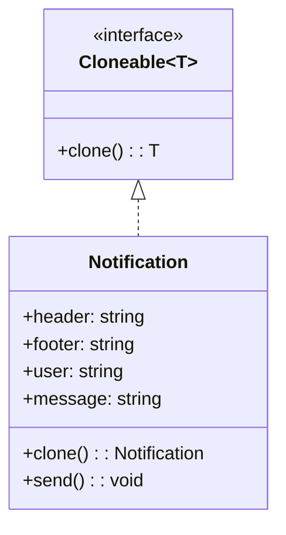

import Tabs from "@theme/Tabs";
import TabItem from "@theme/TabItem";
import CodeBlock from "@theme/CodeBlock";

import tsCode from "@site/src/codes/hardcoded-variability/ts/rfc_prototype.ts";
import phpCode from "@site/src/codes/hardcoded-variability/php/rfc_prototype.php";
import pyCode from "@site/src/codes/hardcoded-variability/py/rfc_prototype.py";

# 🧩 Prototype パターン

## ✅ 設計意図

- オブジェクトを**テンプレートとして複製（clone）**し、差分のみ変更して再利用
- ベタ書きせずに「もと」を再利用できるようにする

## ✅ 適用理由

- **初期化済みの構造**をそのまま複製し、修正・カスタマイズしたいとき
- 可変部分以外を共通化して、**複製コストを削減**

## ✅ 向いているシーン

- 通知テンプレート、ボタン構成、共通設定オブジェクトなどのベース複製

## ✅ コード例

<Tabs groupId="language">
  <TabItem value="ts" label="TypeScript">
    <CodeBlock language="ts">{tsCode}</CodeBlock>
  </TabItem>
  <TabItem value="php" label="PHP">
    <CodeBlock language="php">{phpCode}</CodeBlock>
  </TabItem>
  <TabItem value="python" label="Python">
    <CodeBlock language="python">{pyCode}</CodeBlock>
  </TabItem>
</Tabs>

## ✅ 解説

このコードは `Prototype` パターン を使用して、既存のオブジェクト（`Notification`）を複製（クローン）し、
同じプロパティを持つ新しいインスタンスを生成する設計を実現している。
`Prototype` パターンは、オブジェクトの生成をクラスに依存せず、既存のインスタンスをコピーして新しいインスタンスを作成するデザインパターン。

### 1. Prototype パターンの概要

- **Prototype**: クローン機能を提供するインターフェース
  - このコードでは `Cloneable<T>` が該当
- **ConcretePrototype**: `Prototype` を実装し、具体的なクローン処理を提供するクラス
  - このコードでは `Notification` が該当
- **Client**: `Prototype` を利用してオブジェクトを複製するコード
  - このコードでは `prototype.clone()` を呼び出してクローンを生成する部分が該当

### 2. 主なクラスとその役割

- `Cloneable<T>`
  - `Prototype` の共通インターフェース
  - `clone(): T` メソッドを定義し、オブジェクトのクローンを生成
- `Notification`
  - `ConcretePrototype` クラス
  - `clone` メソッドで自身のコピーを生成
  - `send` メソッドで通知を送信
- クライアントコード
  - `Notification` のプロトタイプを生成し、`clone` メソッドで複製
  - 複製したインスタンスにユーザーやメッセージを設定して通知を送信

### 3. UML クラス図

### 4. Prototype パターンの利点

- **オブジェクト生成の柔軟性**: クラスに依存せず、既存のインスタンスを基に新しいインスタンスを生成可能
- **複雑な初期化処理の回避**: クローンを使用することで、複雑な初期化処理を繰り返す必要がない
- **拡張性**: 新しいクラスを追加する場合も、`clone` メソッドを実装するだけで対応可能

この設計は、既存のオブジェクトを基に新しいインスタンスを生成する必要がある場面で非常に有効であり、コードの柔軟性と再利用性を向上させる。
