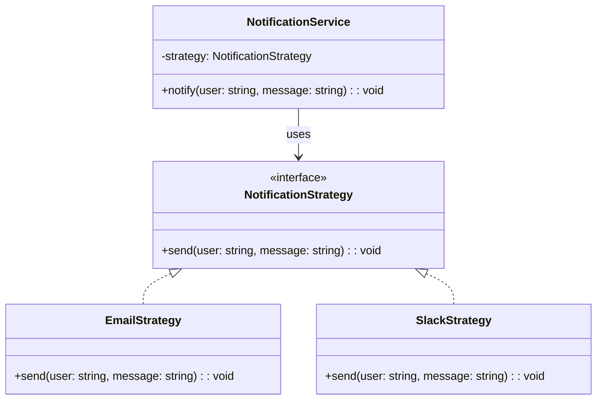

import Tabs from "@theme/Tabs";
import TabItem from "@theme/TabItem";
import CodeBlock from "@theme/CodeBlock";

import tsCode from "@site/src/codes/hardcoded-variability/ts/rfc_strategy.ts";
import phpCode from "@site/src/codes/hardcoded-variability/php/rfc_strategy.php";
import pyCode from "@site/src/codes/hardcoded-variability/py/rfc_strategy.py";

# 🧩 Strategy パターン

## ✅ 設計意図

- **振る舞い（戦略）を外部から差し替え可能**にすることで、処理の柔軟性を高める
- 呼び出し側が、共通処理の「可変部分」を**注入**して選べるようにする

## ✅ 適用理由

- 通知内容やフォーマットの切り替えを**動的に制御したい**
- パターンごとの**再利用性・テスト性を高めたい**

## ✅ 向いているシーン

- 処理の切り替えが頻繁、もしくは構成によって振る舞いを変えたい場合

## ✅ コード例

<Tabs groupId="language">
  <TabItem value="ts" label="TypeScript">
    <CodeBlock language="ts">{tsCode}</CodeBlock>
  </TabItem>
  <TabItem value="php" label="PHP">
    <CodeBlock language="php">{phpCode}</CodeBlock>
  </TabItem>
  <TabItem value="python" label="Python">
    <CodeBlock language="python">{pyCode}</CodeBlock>
  </TabItem>
</Tabs>

## ✅ 解説

このコードは `Strategy` パターン を使用して、通知方法（メールや Slack）を動的に切り替えられる設計を実現している。
`Strategy` パターンは、アルゴリズムや処理をクラスとして分離し、動的に切り替え可能にするデザインパターン。

### 1. Strategy パターンの概要

- **Strategy**: 共通のインターフェースを定義し、異なるアルゴリズムを統一的に扱う
  - このコードでは `NotificationStrategy` が該当
- **ConcreteStrategy**: `Strategy` を実装し、具体的なアルゴリズムを提供する
  - このコードでは `EmailStrategy` と `SlackStrategy` が該当
- **Context**: `Strategy` を利用するクラスで、具体的なアルゴリズムを動的に切り替える
  - このコードでは `NotificationService` が該当

### 2. 主なクラスとその役割

- `NotificationStrategy`
  - 通知方法の共通インターフェース
  - `send(user: string, message: string): void` メソッドを定義
- `EmailStrategy`
  - `NotificationStrategy` を実装した具体的な戦略クラス
  - メール形式で通知を送信
- `SlackStrategy`
  - `NotificationStrategy` を実装した具体的な戦略クラス
  - Slack 形式で通知を送信
- `NotificationService`
  - `Context` クラス
  - コンストラクタで `NotificationStrategy` を受け取り、`notify` メソッドで現在の戦略に応じた通知を送信

### 3. UML クラス図

### 4. Strategy パターンの利点

- **柔軟性**: 戦略を動的に切り替えることで、異なる処理を簡単に適用可能
- **単一責任の原則**: 各戦略が独立したクラスに分離されており、保守性が高い
- **拡張性**: 新しい通知方法を追加する場合も、`NotificationStrategy` を実装するだけで対応可能

この設計は、アルゴリズムや処理を柔軟に切り替える必要がある場面で非常に有効であり、コードの拡張性と保守性を向上させる。
