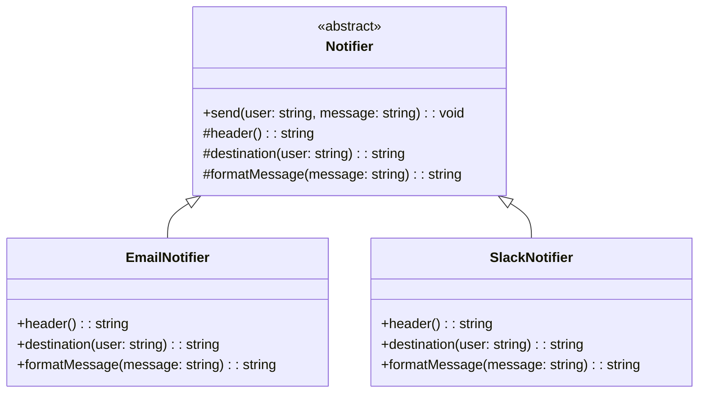

import Tabs from "@theme/Tabs";
import TabItem from "@theme/TabItem";
import CodeBlock from "@theme/CodeBlock";

import tsCode from "@site/src/codes/hardcoded-variability/ts/rfc_template.ts";
import phpCode from "@site/src/codes/hardcoded-variability/php/rfc_template.php";
import pyCode from "@site/src/codes/hardcoded-variability/py/rfc_template.py";

# 🧩 Template Method パターン

## ✅ 設計意図

- 処理全体のテンプレート（流れ）を定義し、**一部の処理をサブクラスに委ねる**
- ベタ書きされていた**変化点のみを明示的に抽象化**

## ✅ 適用理由

- 通知の構成（送信先・本文など）の**共通部分を明確にしつつ、差分だけを分けたい**
- **処理の流れが固定**されているが、一部を柔軟に変えたいときに最適

## ✅ 向いているシーン

- 処理手順が共通していて、特定ステップだけ異なるケース
- 初期化・実行・終了などの「型」がある処理

## ✅ コード例

<Tabs groupId="language">
  <TabItem value="ts" label="TypeScript">
    <CodeBlock language="ts">{tsCode}</CodeBlock>
  </TabItem>
  <TabItem value="php" label="PHP">
    <CodeBlock language="php">{phpCode}</CodeBlock>
  </TabItem>
  <TabItem value="python" label="Python">
    <CodeBlock language="python">{pyCode}</CodeBlock>
  </TabItem>
</Tabs>

## ✅ 解説

このコードは `Template Method` パターン を使用して、通知処理の共通フローを抽象クラス（`Notifier`）で定義し、
具体的な処理（メール通知や Slack 通知）をサブクラスで実装する設計を実現している。
`Template Method` パターンは、アルゴリズムの骨組みをスーパークラスで定義し、詳細な処理をサブクラスで実装するデザインパターン。

### 1. Template Method パターンの概要

- **AbstractClass**: アルゴリズムの骨組みを定義し、具体的な処理をサブクラスに委譲する抽象クラス
  - このコードでは `Notifier` が該当
- **ConcreteClass**: `AbstractClass` を継承し、抽象メソッドを実装して具体的な処理を提供するクラス
  - このコードでは `EmailNotifier` と `SlackNotifier` が該当

### 2. 主なクラスとその役割

- `Notifier`
  - 抽象クラス（`AbstractClass`）
  - `send` メソッドで通知処理の共通フローを定義
  - ヘッダーを出力
  - メッセージをフォーマット
  - 宛先を出力
  - `header`, `destination`, `formatMessage` の抽象メソッドをサブクラスに委譲
- `EmailNotifier`
  - `Notifier` を継承した具体クラス（`ConcreteClass`）
  - メール通知のヘッダー、宛先、メッセージフォーマットを実装
- `SlackNotifier`
  - `Notifier` を継承した具体クラス（`ConcreteClass`）
  - Slack 通知のヘッダー、宛先、メッセージフォーマットを実装

### 3. UML クラス図

### 4. Template Method パターンの利点

- **コードの再利用**: 共通の処理フローをスーパークラスにまとめることで、コードの重複を削減
- **拡張性**: 新しい通知方法を追加する場合も、`Notifier` を継承して抽象メソッドを実装するだけで対応可能
- **一貫性**: 共通の処理フローをスーパークラスで定義することで、処理の一貫性を確保

この設計は、共通の処理フローを持つが、一部の処理が異なる場合に非常に有効であり、コードの保守性と拡張性を向上させる。
