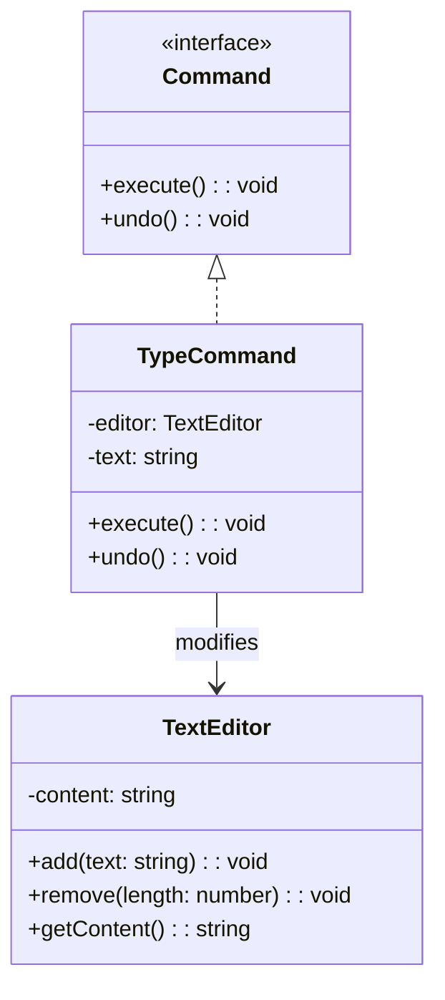

import Tabs from "@theme/Tabs";
import TabItem from "@theme/TabItem";
import CodeBlock from "@theme/CodeBlock";

import tsCode from "@site/src/codes/no-undo-history/ts/rfc_command.ts";
import phpCode from "@site/src/codes/no-undo-history/php/rfc_command.php";
import pyCode from "@site/src/codes/no-undo-history/py/rfc_command.py";

# 🧩 Command パターン

## ✅ 設計意図

- 各操作を「命令オブジェクト」として抽象化し、**履歴として保存**
- 実行 (`execute()`)、取り消し (`undo()`)、再実行が可能

## ✅ 適用理由

- 操作の履歴管理、Undo/Redo の実装に最適
- 操作単位の記録が可能で、テストやログ出力にも応用可

## ✅ 向いているシーン

- テキストエディタ、フォーム、バッチ処理、GUI 操作 など
- 「操作」と「結果」を分離して管理したい場面

## ✅ コード例

<Tabs groupId="language">
  <TabItem value="ts" label="TypeScript">
    <CodeBlock language="ts">{tsCode}</CodeBlock>
  </TabItem>
  <TabItem value="php" label="PHP">
    <CodeBlock language="php">{phpCode}</CodeBlock>
  </TabItem>
  <TabItem value="python" label="Python">
    <CodeBlock language="python">{pyCode}</CodeBlock>
  </TabItem>
</Tabs>

## ✅ 解説

このコードは `Command` パターン を使用して、操作（コマンド）をオブジェクトとしてカプセル化し、
操作の実行や取り消し（`Undo`）を可能にする設計を実現している。`Command` パターンは、操作をオブジェクトとして表現し、
操作の履歴管理や取り消しを容易にするデザインパターン。

### 1. Command パターンの概要

- **Command**: 操作を表現するインターフェース
  - このコードでは `Command` が該当
- **ConcreteCommand**: `Command` を実装し、具体的な操作を定義するクラス
  - このコードでは `TypeCommand` が該当
- **Receiver**: 実際の操作を実行するクラス
  - このコードでは `TextEditor` が該当
- **Invoker**: `Command` を実行する役割を持つクラス（またはコード）
  - このコードでは `history` 配列を利用してコマンドを管理

### 2. 主なクラスとその役割

- `Command`
  - 操作の共通インターフェース
  - `execute` メソッドで操作を実行
  - `undo` メソッドで操作を取り消し
- `TypeCommand`
  - `Command` を実装した具体的なコマンドクラス
  - `execute` メソッドでテキストを追加
  - `undo` メソッドで追加したテキストを削除
- `TextEditor`
  - 受信者（`Receiver`）
  - テキストの追加や削除を実行し、現在の内容を保持
- クライアントコード
  - `TypeCommand` を生成し、`execute` メソッドを呼び出して操作を実行
  - `history` 配列でコマンドの履歴を管理し、`undo` メソッドで操作を取り消し

### 3. UML クラス図

### 4. Command パターンの利点

- **操作のカプセル化**: 操作をオブジェクトとして表現することで、操作の履歴管理や取り消しが容易になる
- **柔軟性**: 新しい操作を追加する場合も、`Command` を実装するだけで対応可能
- **履歴管理**: 操作の履歴を保存し、`Undo/Redo` 機能を実現可能

この設計は、操作の履歴管理や取り消しが必要な場面で非常に有効であり、コードの柔軟性と保守性を向上させる。
