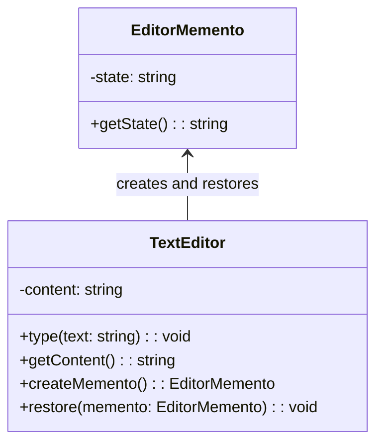

import Tabs from "@theme/Tabs";
import TabItem from "@theme/TabItem";
import CodeBlock from "@theme/CodeBlock";

import tsCode from "@site/src/codes/no-undo-history/ts/rfc_memento.ts";
import phpCode from "@site/src/codes/no-undo-history/php/rfc_memento.php";
import pyCode from "@site/src/codes/no-undo-history/py/rfc_memento.py";

# 🧩 Memento パターン

## ✅ 設計意図

- オブジェクトの状態（スナップショット）を保存しておき、**後で復元できるようにする**
- 外部から状態にアクセスせず、**内部状態をそのまま記録**

## ✅ 適用理由

- 特定のタイミングで状態を保存 → 戻す
- 完全な復元を目的とする場合に向いている

## ✅ 向いているシーン

- フォームの一括入力、ゲームのセーブ機能、ドキュメントの自動保存など

## ✅ コード例

<Tabs groupId="language">
  <TabItem value="ts" label="TypeScript">
    <CodeBlock language="ts">{tsCode}</CodeBlock>
  </TabItem>
  <TabItem value="php" label="PHP">
    <CodeBlock language="php">{phpCode}</CodeBlock>
  </TabItem>
  <TabItem value="python" label="Python">
    <CodeBlock language="python">{pyCode}</CodeBlock>
  </TabItem>
</Tabs>

## ✅ 解説

このコードは `Memento` パターン を使用して、`TextEditor` の状態を保存し、後でその状態に戻す（`Undo`）機能を実現している。
`Memento` パターンは、オブジェクトの内部状態を保存し、後でその状態を復元できるようにするデザインパターン。

### 1. Memento パターンの概要

- **Memento**: 保存される状態を表現するクラス
  - このコードでは `EditorMemento` が該当
- **Originator**: 状態を持ち、`Memento` を作成・復元するクラス
  - このコードでは `TextEditor` が該当
- **Caretaker**: `Memento` を管理し、必要に応じて `Originator` に渡すクラス（またはコード）
  - このコードでは `history` 配列が該当

### 2. 主なクラスとその役割

- `EditorMemento`
  - `Memento` クラス
  - `TextEditor` の状態を保存し、その状態を取得するための `getState` メソッドを提供
- `TextEditor`
  - `Originator` クラス
  - 現在の状態を保持し、`createMemento` メソッドで状態を保存
  - `restore` メソッドで `Memento` を使用して状態を復元
- `Caretaker`
  - `Memento` を管理する役割を持つ
  - このコードでは `history` 配列がその役割を果たし、状態の履歴を保存・管理

### 3. UML クラス図

### 4. Memento パターンの利点

- **状態の保存と復元**: オブジェクトの状態を簡単に保存・復元可能
- **カプセル化の維持**: `Memento` によって `Originator` の内部状態が外部に漏れない
- **履歴管理**: `Caretaker` を使用して状態の履歴を管理可能

この設計は、オブジェクトの状態を保存して後で復元する必要がある場面で非常に有効であり、`Undo/Redo` 機能を実現する際に役立つ。
