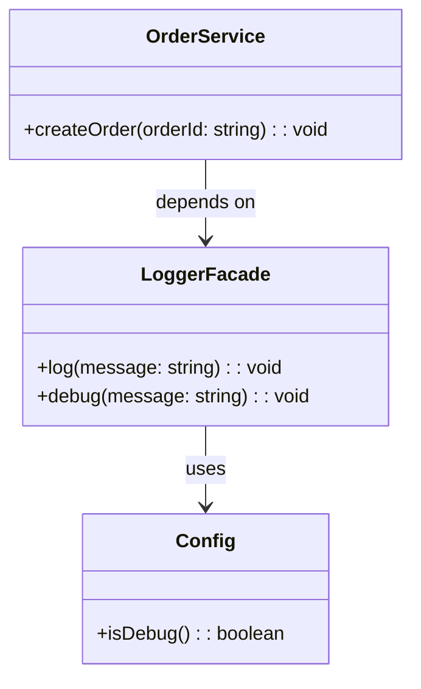

import Tabs from "@theme/Tabs";
import TabItem from "@theme/TabItem";
import CodeBlock from "@theme/CodeBlock";

import tsCode from "@site/src/codes/scattered-concerns/ts/rfc_facade.ts";
import phpCode from "@site/src/codes/scattered-concerns/php/rfc_facade.php";
import pyCode from "@site/src/codes/scattered-concerns/py/rfc_facade.py";

# 🧩 Facade パターン

## ✅ 設計意図

- ログ出力や設定取得など、**複数の下位処理を 1 つのインターフェースにまとめる**
- 利用側はシンプルな API を通じて使える

## ✅ 適用理由

- ログや設定の取得方法を**抽象化・隠蔽**
- 外部ライブラリや実装が変わっても、呼び出し元は影響を受けにくい

## ✅ 向いているシーン

- サブシステムが複雑になっている場合に、**呼び出しを簡潔に統一したい**

## ✅ コード例

<Tabs groupId="language">
  <TabItem value="ts" label="TypeScript">
    <CodeBlock language="ts">{tsCode}</CodeBlock>
  </TabItem>
  <TabItem value="php" label="PHP">
    <CodeBlock language="php">{phpCode}</CodeBlock>
  </TabItem>
  <TabItem value="python" label="Python">
    <CodeBlock language="python">{pyCode}</CodeBlock>
  </TabItem>
</Tabs>

## ✅ 解説

このコードは `Facade` パターン を使用して、`LoggerFacade` を通じてログ出力の処理を簡潔に利用できるようにする設計を実現している。
`Facade` パターンは、複雑なサブシステムを簡単に利用できるようにするための統一インターフェースを提供するデザインパターン。

### 1. Facade パターンの概要

- **Subsystem Classes**: 複雑な処理を提供するクラス
  - このコードでは `Config` が該当
- **Facade**: サブシステムを統一的に利用するための簡潔なインターフェースを提供するクラス
  - このコードでは `LoggerFacade` が該当
- **Client**: `Facade` を利用してサブシステムを操作するクラス
  - このコードでは `OrderService` が該当

### 2. 主なクラスとその役割

- `Config`
  - サブシステムの一部
  - 環境変数 `DEBUG_MODE` を基にデバッグモードの有効/無効を判定
- `LoggerFacade`
  - `Facade` クラス
  - ログ出力とデバッグログ出力の統一インターフェースを提供
  - 内部で `Config` を使用してデバッグモードを判定
- `OrderService`
  - クライアントクラス
  - `LoggerFacade` を利用してログ出力を行う

### 3. UML クラス図

### 4.Facade パターンの利点

- **簡潔なインターフェース**: クライアントは複雑なサブシステム（`Config`）を意識せずに操作可能
- **疎結合**: クライアントとサブシステム間の結合度を低減
- **保守性向上**: サブシステムの変更が `Facade` 内に閉じ込められるため、クライアントコードへの影響を最小化

この設計は、複雑な内部処理を隠蔽し、クライアントに対して簡潔なインターフェースを提供する必要がある場面で非常に有効であり、
コードの可読性と保守性を向上させる。
