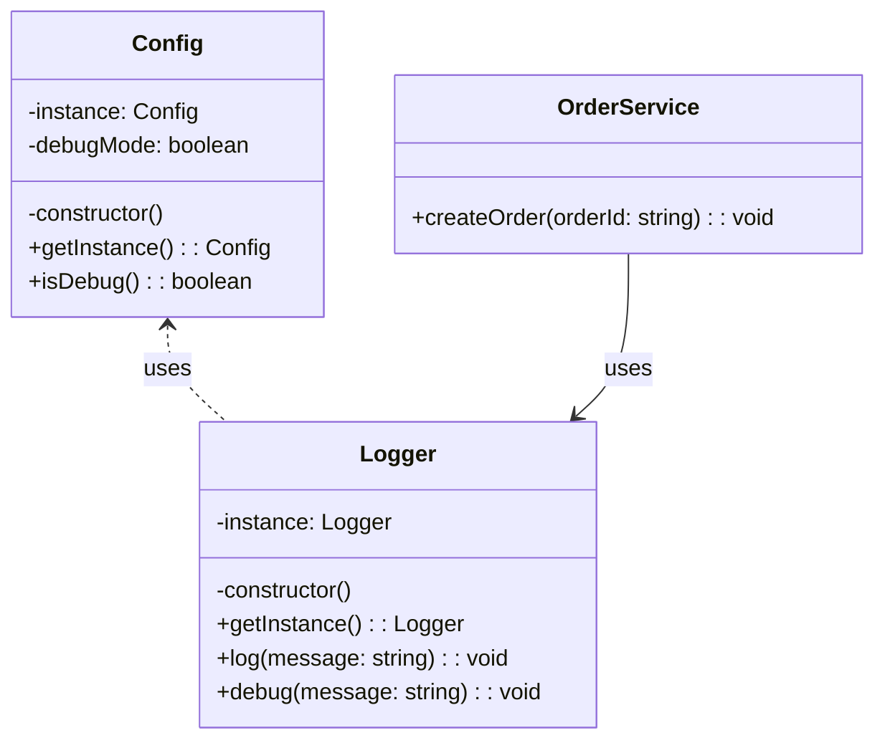

import Tabs from "@theme/Tabs";
import TabItem from "@theme/TabItem";
import CodeBlock from "@theme/CodeBlock";

import tsCode from "@site/src/codes/scattered-concerns/ts/rfc_singleton.ts";
import phpCode from "@site/src/codes/scattered-concerns/php/rfc_singleton.php";
import pyCode from "@site/src/codes/scattered-concerns/py/rfc_singleton.py";

# 🧩 Singleton パターン

## ✅ 設計意図

- ロガーや設定クラスのインスタンスを**1 つだけ生成し再利用**
- グローバルアクセスを提供しつつ、状態を一元管理

## ✅ 適用理由

- 「同じものをどこからでも使いたい」ケースに最適
- ログ形式の統一、設定の集中管理が容易になる

## ✅ 向いているシーン

- ログ・設定・キャッシュ・DB 接続など、**共有状態が必要なユーティリティ**

## ✅ コード例

<Tabs groupId="language">
  <TabItem value="ts" label="TypeScript">
    <CodeBlock language="ts">{tsCode}</CodeBlock>
  </TabItem>
  <TabItem value="php" label="PHP">
    <CodeBlock language="php">{phpCode}</CodeBlock>
  </TabItem>
  <TabItem value="python" label="Python">
    <CodeBlock language="python">{pyCode}</CodeBlock>
  </TabItem>
</Tabs>

## ✅ 解説

このコードは `Singleton` パターン を使用して、`Config` と `Logger` のインスタンスがアプリケーション全体で一意であることを保証している。
`Singleton` パターンは、クラスのインスタンスが 1 つだけであることを保証し、そのインスタンスへのグローバルなアクセスを提供するデザインパターン。

### 1. Singleton パターンの概要

- **Singleton**: クラスのインスタンスを 1 つだけ生成し、それをグローバルに提供する
  - このコードでは `Config` と `Logger` が該当
- **Client**: `Singleton` インスタンスを利用するクラス
  - このコードでは `OrderService` が該当

### 2. 主なクラスとその役割

- `Config`
  - `Singleton` クラス
  - アプリケーションの設定を管理
  - 環境変数 `DEBUG_MODE` を基にデバッグモードの有効/無効を判定
- `Logger`
  - `Singleton` クラス
  - ログ出力機能を提供
  - デバッグモードが有効な場合にデバッグログを出力
- `OrderService`
  - クライアントクラス
  - `Logger` を利用して注文作成時のログを出力

### 3. UML クラス図

### 4. Singleton パターンの利点

- **インスタンスの一意性**: アプリケーション全体で 1 つのインスタンスのみを保持
- **グローバルアクセス**: `getInstance` メソッドを通じて、どこからでもインスタンスにアクセス可能
- **リソースの節約**: 必要に応じてインスタンスを生成（遅延初期化）することで、リソースを節約

:::warning

- テストの難しさ: グローバルな状態を持つため、ユニットテストでモックや依存性注入が難しくなる場合がある
- 多用のリスク: `Singleton` を多用すると、コードが密結合になり、保守性が低下する可能性がある

:::

この設計は、アプリケーション全体で共有されるリソース（例: 設定やログ機能）を管理する際に非常に有効である。ただし、適切な場面で使用することが重要。
