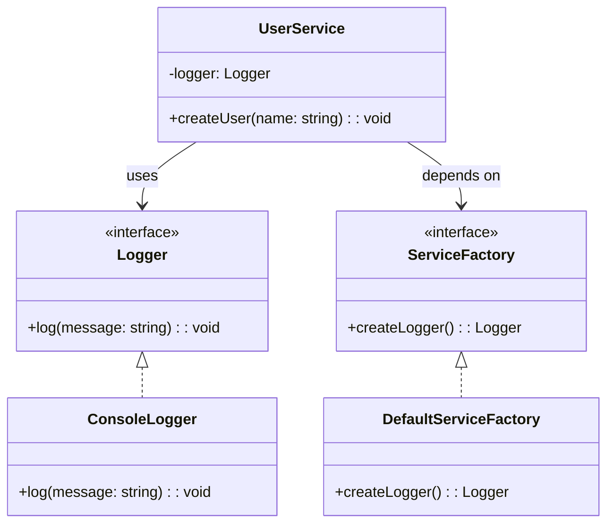

import Tabs from "@theme/Tabs";
import TabItem from "@theme/TabItem";
import CodeBlock from "@theme/CodeBlock";

import tsCode from "@site/src/codes/scattered-instaniation/ts/rfc_abstract.ts";
import phpCode from "@site/src/codes/scattered-instaniation/php/rfc_abstract.php";
import pyCode from "@site/src/codes/scattered-instaniation/py/rfc_abstract.py";

# 🧩 Abstract Factory パターン

## ✅ 設計意図

- 関連するオブジェクト群（例：Logger + Database）を**まとめて生成する窓口**を作る
- 環境やバージョンごとに**「一式切り替え」**が可能

## ✅ 適用理由

- 複数の依存をまとめて切り替えたい
- 実装ごとにインスタンスの生成方法を変えたい

## ✅ 向いているシーン

- ステージング／本番環境など、環境ごとに依存関係を切り替える
- UI テーマ、ストレージプロバイダーなど

## ✅ コード例

<Tabs groupId="language">
  <TabItem value="ts" label="TypeScript">
    <CodeBlock language="ts">{tsCode}</CodeBlock>
  </TabItem>
  <TabItem value="php" label="PHP">
    <CodeBlock language="php">{phpCode}</CodeBlock>
  </TabItem>
  <TabItem value="python" label="Python">
    <CodeBlock language="python">{pyCode}</CodeBlock>
  </TabItem>
</Tabs>

## ✅ 解説

このコードは `Abstract Factory` パターン を使用して、関連するオブジェクト（`Logger`）の生成をファクトリに委譲し、
クライアントコードから生成の詳細を隠蔽する設計を実現している。
`Abstract Factory` パターンは、一連の関連オブジェクトを生成するためのインターフェースを提供し、
具体的な生成方法をサブクラスに委譲するデザインパターン。

### 1. Abstract Factory パターンの概要

- **AbstractFactory**: 製品を生成するためのインターフェースを定義
  - このコードでは `ServiceFactory` が該当
- **ConcreteFactory**: `AbstractFactory` を実装し、具体的な製品生成ロジックを提供
  - このコードでは `DefaultServiceFactory` が該当
- **Product**: `AbstractFactory` によって生成されるオブジェクト
  - このコードでは `Logger` が該当
- **ConcreteProduct**: `Product` を実装した具体的な製品
  - このコードでは `ConsoleLogger` が該当
- **Client**: `AbstractFactory` を使用して製品を生成し、利用する
  - このコードでは `UserService` が該当

### 2. 主なクラスとその役割

- `Logger`
  - 製品の共通インターフェース
  - `log(message: string): void` メソッドを定義
- `ConsoleLogger`
  - `Logger` を実装した具体的な製品
  - コンソールにログを出力する
- `ServiceFactory`
  - 抽象ファクトリ
  - `createLogger` `メソッドを定義し、Logger` を生成する責務を持つ
- `DefaultServiceFactory`
  - `ServiceFactory` を実装した具体的なファクトリ
  - `ConsoleLogger` を生成する
- `UserService`
  - クライアントクラス
  - コンストラクタで `ServiceFactory` を受け取り、`Logger` を生成して利用

### 3. UML クラス図

### 4. Abstract Factory パターンの利点

- **生成の詳細を隠蔽**: クライアントコードは具体的な生成ロジックを知らずに製品を利用可能
- **一貫性のある生成**: 関連する製品（例: 複数の `Logger` 実装）を一貫性を持って生成可能
- **拡張性**: 新しいファクトリや製品を追加する場合も、既存のコードに影響を与えずに対応可能

この設計は、関連するオブジェクトの生成を統一し、生成ロジックをクライアントコードから分離する。
特に、複数の製品が関連している場合や、生成ロジックが変更される可能性がある場合に有効に機能する。
