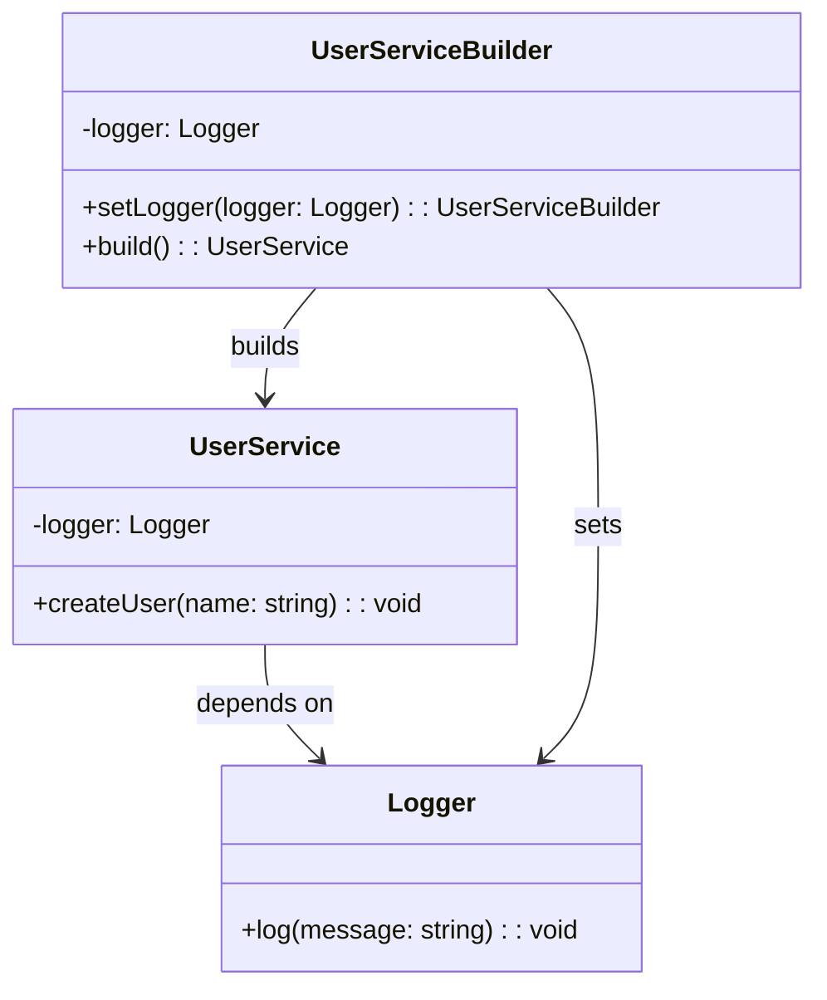

import Tabs from "@theme/Tabs";
import TabItem from "@theme/TabItem";
import CodeBlock from "@theme/CodeBlock";

import tsCode from "@site/src/codes/scattered-instaniation/ts/rfc_builder.ts";
import phpCode from "@site/src/codes/scattered-instaniation/php/rfc_builder.php";
import pyCode from "@site/src/codes/scattered-instaniation/py/rfc_builder.py";

# 🧩 Builder パターン

## ✅ 設計意図

- 複雑なオブジェクトを**ステップごとに構築**
- 同じ構築プロセスで**異なる表現を作れる**

## ✅ 適用理由

- プロパティの組み合わせが多い場合に初期化処理を見通しよく管理できる
- 一部省略可能なパラメータを順序・バリデーション付きで組み立てたい

## ✅ 向いているシーン

- フォームや設定オブジェクトのように**オプションが多いオブジェクトの初期化**

## ✅ コード例

<Tabs groupId="language">
  <TabItem value="ts" label="TypeScript">
    <CodeBlock language="ts">{tsCode}</CodeBlock>
  </TabItem>
  <TabItem value="php" label="PHP">
    <CodeBlock language="php">{phpCode}</CodeBlock>
  </TabItem>
  <TabItem value="python" label="Python">
    <CodeBlock language="python">{pyCode}</CodeBlock>
  </TabItem>
</Tabs>

## ✅ 解説

このコードは `Builder` パターン を使用して、複雑なオブジェクト（`UserService`）の生成を段階的に構築する設計を実現している。
`Builder` パターンは、オブジェクトの生成過程を分離し、柔軟かつ安全に構築できるようにするデザインパターン。

### 1. Builder パターンの概要

- **Builder**: オブジェクトの生成手順を定義するクラス
  - このコードでは `UserServiceBuilder` が該当
- **Product**: `Builder` によって生成されるオブジェクト
  - このコードでは `UserService` が該当
- **Client**: `Builder` を使用してオブジェクトを構築するコード
  - このコードでは `UserServiceBuilder` を利用して `UserService` を生成する部分が該当

### 2. 主なクラスとその役割

- `Logger`
  - ログ出力を行うユーティリティクラス
  - `UserService` の依存オブジェクトとして利用される
- `UserService`
  - 対象クラス（`Product`）
  - ユーザー作成機能を提供し、`Logger` を使用してログを出力
- `UserServiceBuilder`
  - Builder クラス
  - `setLogger` メソッドで `Logger` を設定し、`build` メソッドで `UserService` を生成
  - 必須の依存関係（`Logger`）が設定されていない場合はエラーをスロー
- クライアントコード
  - `UserServiceBuilder` を使用して `UserService` を構築
  - 必要な依存関係を設定し、`build` メソッドでインスタンスを生成

### 3. UML クラス図

### 4. Builder パターンの利点

- **柔軟性**: 必要な依存関係を段階的に設定可能
- **安全性**: 必須の依存関係が設定されていない場合にエラーをスローすることで、不完全なオブジェクトの生成を防止
- **可読性**: メソッドチェーンを使用することで、構築プロセスが直感的で可読性が高い

この設計は、複雑なオブジェクトの生成を柔軟かつ安全に行う。特に、依存関係が多いオブジェクトや、生成手順が複雑な場合に有効に機能する。
