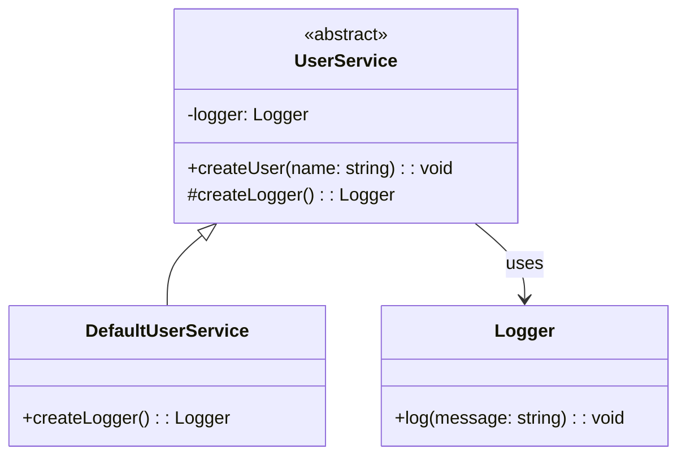

import Tabs from "@theme/Tabs";
import TabItem from "@theme/TabItem";
import CodeBlock from "@theme/CodeBlock";

import tsCode from "@site/src/codes/scattered-instaniation/ts/rfc_factory.ts";
import phpCode from "@site/src/codes/scattered-instaniation/php/rfc_factory.php";
import pyCode from "@site/src/codes/scattered-instaniation/py/rfc_factory.py";

# 🧩 Factory Method パターン

## ✅ 設計意図

- 「どのクラスを生成するか」を**サブクラスに任せる**
- 生成の責務を集約し、**処理の柔軟性と拡張性を高める**

## ✅ 適用理由

- Logger のようなユーティリティを共通の工場メソッドで管理
- 実装の切り替えやモック導入が容易になる

## ✅ 向いているシーン

- バージョン別や条件に応じて生成クラスを切り替えたいとき
- フレームワークレベルで拡張性を意識した設計をしたいとき

## ✅ コード例

<Tabs groupId="language">
  <TabItem value="ts" label="TypeScript">
    <CodeBlock language="ts">{tsCode}</CodeBlock>
  </TabItem>
  <TabItem value="php" label="PHP">
    <CodeBlock language="php">{phpCode}</CodeBlock>
  </TabItem>
  <TabItem value="python" label="Python">
    <CodeBlock language="python">{pyCode}</CodeBlock>
  </TabItem>
</Tabs>

## ✅ 解説

このコードは `Factory Method` パターン を使用して、オブジェクト生成の責務をサブクラスに委譲する設計を実現している。
`Factory Method` パターンは、インスタンス生成の詳細を隠蔽し、生成プロセスをサブクラスでカスタマイズ可能にするデザインパターン。

### 1. Factory Method パターンの概要

- **Creator**: オブジェクト生成のための抽象メソッド（`Factory Method`）を定義するクラス
  - このコードでは `UserService` が該当
- **ConcreteCreator**: `Factory Method` を実装し、具体的なオブジェクト生成ロジックを提供するクラス
  - このコードでは `DefaultUserService` が該当
- **Product**: `Factory Method` によって生成されるオブジェクト
  - このコードでは `Logger` が該当

### 2. 主なクラスとその役割

- `Logger`
  - `Factory Method` によって生成される具体的なオブジェクト（`Product`）
  - ログ出力の機能を提供
- `UserService`
  - `Creator` クラス
  - `createLogger` という抽象メソッド（`Factory Method`）を定義し、サブクラスに生成ロジックを委譲
  - `createUser` メソッドでユーザー作成時に `Logger` を使用
- `DefaultUserService`
  - `ConcreteCreator` クラス
  - `createLogger` メソッドを実装し、具体的な `Logger` インスタンスを生成

### 3. UML クラス図

### 4. Factory Method パターンの利点

- **生成プロセスのカスタマイズ**: サブクラスで `Factory Method` をオーバーライドすることで、生成されるオブジェクトを柔軟に変更可能。
- **疎結合**: `Creator` クラスは具体的な `Product` クラスに依存せず、拡張性が高い。
- **再利用性**: `Factory Method` を使用することで、生成ロジックを統一し、コードの再利用性を向上。

この設計は、オブジェクト生成の責務を分離し、生成プロセスを柔軟にカスタマイズ可能にする。
特に、生成されるオブジェクトが変更される可能性がある場合や、生成ロジックが複雑な場合に有効に機能する。
