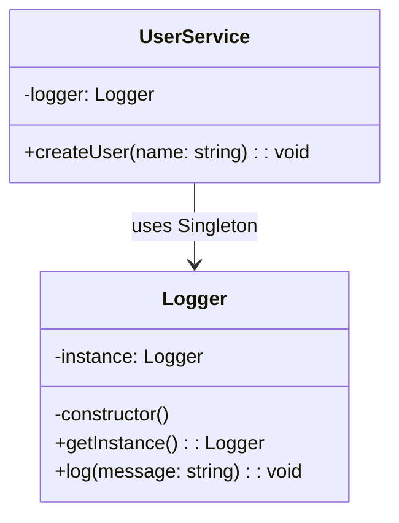

import Tabs from "@theme/Tabs";
import TabItem from "@theme/TabItem";
import CodeBlock from "@theme/CodeBlock";

import tsCode from "@site/src/codes/scattered-instaniation/ts/rfc_singleton.ts";
import phpCode from "@site/src/codes/scattered-instaniation/php/rfc_singleton.php";
import pyCode from "@site/src/codes/scattered-instaniation/py/rfc_singleton.py";

# 🧩 Singleton パターン

## ✅ 設計意図

- インスタンスが**1 つしか存在しないように制限**し、再利用する

## ✅ 適用理由

- 同じインスタンスをアプリケーション全体で使い回したい
- ロガー、設定、キャッシュなどの「共有状態を持つ」処理に適している

## ✅ 向いているシーン

- グローバルユーティリティ（Logger, ConfigManager など）

## ✅ コード例

<Tabs groupId="language">
  <TabItem value="ts" label="TypeScript">
    <CodeBlock language="ts">{tsCode}</CodeBlock>
  </TabItem>
  <TabItem value="php" label="PHP">
    <CodeBlock language="php">{phpCode}</CodeBlock>
  </TabItem>
  <TabItem value="python" label="Python">
    <CodeBlock language="python">{pyCode}</CodeBlock>
  </TabItem>
</Tabs>

## ✅ 解説

このコードは `Singleton` パターン を使用して、`Logger` クラスのインスタンスがアプリケーション全体で一意であることを保証している。
`Singleton` パターンは、クラスのインスタンスが 1 つだけであることを保証し、そのインスタンスへのグローバルなアクセスを提供するデザインパターン。

### 1. Singleton パターンの概要

- **Singleton**: クラスのインスタンスを 1 つだけ生成し、それをグローバルに提供する
  - このコードでは `Logger` が該当
- **Client**: `Singleton` インスタンスを利用するクラス
  - このコードでは `UserService` が該当

### 2. 主なクラスとその役割

- `Logger`
  - `Singleton` クラス
  - プライベートなコンストラクタを持ち、外部から直接インスタンス化できないようにする
  - `getInstance` メソッドで唯一のインスタンスを取得
  - ログ出力機能を提供
- `UserService`
  - クライアントクラス
  - コンストラクタ内で `Logger` の `Singleton` インスタンスを取得し、ログ出力に使用

### 3. UML クラス図

### 4. Singleton パターンの利点

- **インスタンスの一意性**: アプリケーション全体で 1 つのインスタンスのみを保持
- **グローバルアクセス**: `getInstance` メソッドを通じて、どこからでもインスタンスにアクセス可能
- **リソースの節約**: 必要に応じてインスタンスを生成（遅延初期化）することで、リソースを節約

:::warning

- テストの難しさ: グローバルな状態を持つため、ユニットテストでモックや依存性注入が難しくなる場合がある
- 多用のリスク: `Singleton` を多用すると、コードが密結合になり、保守性が低下する可能性がある

:::

この設計は、アプリケーション全体で共有されるリソース（例: ログ機能）を管理する際に非常に有効である。ただし、適切な場面で使用することが重要。
