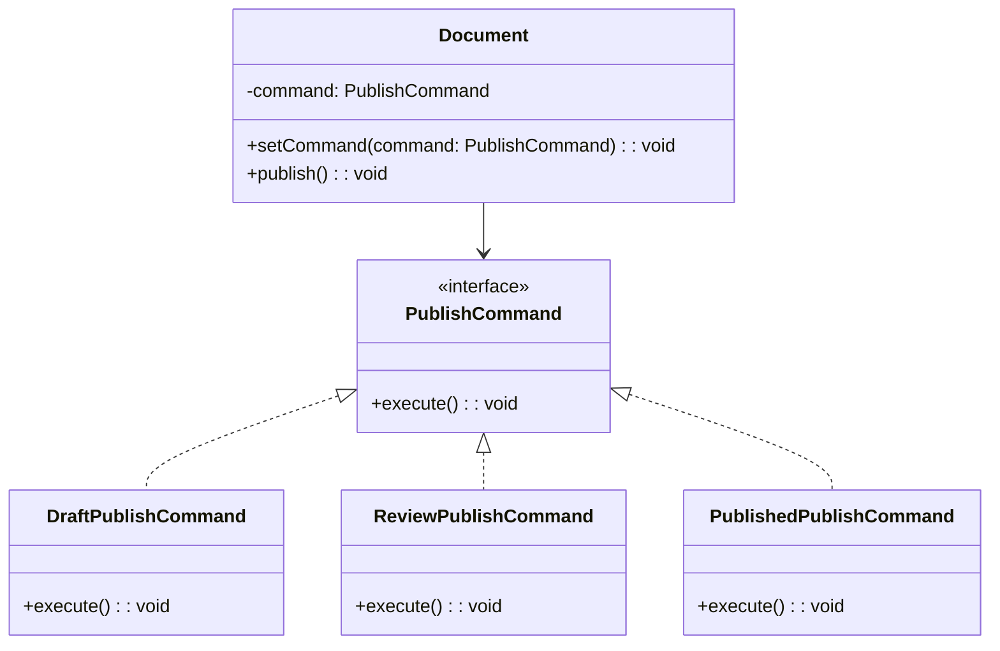

import Tabs from "@theme/Tabs";
import TabItem from "@theme/TabItem";
import CodeBlock from "@theme/CodeBlock";

import tsCode from "@site/src/codes/single-state-handling/ts/rfc_command.ts";
import phpCode from "@site/src/codes/single-state-handling/php/rfc_command.php";
import pyCode from "@site/src/codes/single-state-handling/py/rfc_command.py";

# 🧩 Command パターン

## ✅ 設計意図

- 実行内容を「命令」としてオブジェクト化する
- 状態ごとの処理を実行タイミングに応じて呼び出す

## ✅ 適用理由

- 状態というよりは、「実行する内容をあとから差し替える」文脈で使える
- 操作履歴や Undo/Redo が関係する場合に有効

## ✅ コード例

<Tabs groupId="language">
  <TabItem value="ts" label="TypeScript">
    <CodeBlock language="ts">{tsCode}</CodeBlock>
  </TabItem>
  <TabItem value="php" label="PHP">
    <CodeBlock language="php">{phpCode}</CodeBlock>
  </TabItem>
  <TabItem value="python" label="Python">
    <CodeBlock language="python">{pyCode}</CodeBlock>
  </TabItem>
</Tabs>

## ✅ 解説

このコードは `Command` パターン を使用して、ドキュメントの公開処理をコマンドとしてカプセル化し、動的に切り替えられる設計を実現している。
`Command` パターンは、操作をオブジェクトとして表現し、操作の実行を遅延させたり、動的に切り替えたりするデザインパターン。

### 1. Command パターンの概要

- **Command**: 操作を表現するインターフェース
  - このコードでは `PublishCommand` が該当
- **ConcreteCommand**: `Command` を実装し、具体的な操作を定義するクラス
  - このコードでは `DraftPublishCommand`, `ReviewPublishCommand`, `PublishedPublishCommand` が該当
- **Invoker**: `Command` を実行する役割を持つクラス
  - このコードでは `Document` が該当
- **Client**: `Command` を生成し、`Invoker` に渡す役割を持つ
  - このコードでは `new Document(new DraftPublishCommand())` の部分が該当

### 2. 主なクラスとその役割

- `PublishCommand`
  - コマンドの共通インターフェース
  - `execute(): void` メソッドを定義
- `DraftPublishCommand`, `ReviewPublishCommand`, `PublishedPublishCommand`
  - `PublishCommand` を実装した具体的なコマンドクラス
  - 各クラスで異なる公開処理を提供
  - `DraftPublishCommand`: 「レビュー依頼を送信」
  - `ReviewPublishCommand`: 「公開しました」
  - `PublishedPublishCommand`: 「すでに公開済みです」
- `Document`
  - Invoker クラス
  - コンストラクタで `PublishCommand` を受け取り、`publish` メソッドでコマンドを実行
  - `setCommand` メソッドでコマンドを動的に切り替え可能

### 3. UML クラス図

### 4. Command パターンの利点

- **操作のカプセル化**: 操作をオブジェクトとして表現することで、操作の実行を遅延させたり、動的に切り替えたりできる
- **柔軟性**: 新しい操作を追加する場合も、`PublishCommand` を実装するだけで対応可能
- **Invoker の汎用性**: `Document` はどのコマンドでも実行可能で、汎用性が高い

この設計は、操作をオブジェクトとして扱うことで、柔軟性と拡張性を向上させる。特に、操作の切り替えや履歴管理が必要な場面で有効に機能する。
