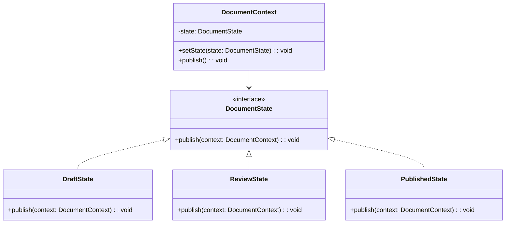

import Tabs from "@theme/Tabs";
import TabItem from "@theme/TabItem";
import CodeBlock from "@theme/CodeBlock";

import tsCode from "@site/src/codes/single-state-handling/ts/rfc_state.ts";
import phpCode from "@site/src/codes/single-state-handling/php/rfc_state.php";
import pyCode from "@site/src/codes/single-state-handling/py/rfc_state.py";

# 🧩 State パターン

## ✅ 設計意図

- オブジェクトの状態を**クラスとして表現し、状態ごとに処理を定義**
- 現在の状態がそのまま「振る舞いの選択」に直結

## ✅ 適用理由

- 状態ごとの処理を**クラス分けして責任分離**できる
- 状態遷移のルールも状態自身が知っているため、**制御が明確**

## ✅ 向いているシーン

- ステップ処理、状態遷移、モード切り替えなどの UI や業務フロー
- 状態が増える可能性が高く、将来的に拡張が想定される

## ✅ コード例

<Tabs groupId="language">
  <TabItem value="ts" label="TypeScript">
    <CodeBlock language="ts">{tsCode}</CodeBlock>
  </TabItem>
  <TabItem value="php" label="PHP">
    <CodeBlock language="php">{phpCode}</CodeBlock>
  </TabItem>
  <TabItem value="python" label="Python">
    <CodeBlock language="python">{pyCode}</CodeBlock>
  </TabItem>
</Tabs>

## ✅ 解説

このコードは `State` パターン を使用して、ドキュメントの状態（`Draft`, `Review`, `Published`）に応じた振る舞いを切り替える設計を実現している。`State` パターンは、オブジェクトの内部状態に応じて振る舞いを変更するデザインパターンであり、条件分岐を排除してコードの可読性と保守性を向上させる。

### 1. State パターンの概要

- **State**: 状態ごとの振る舞いを定義するインターフェース
  - このコードでは `DocumentState` が該当
- **ConcreteState**: `State` を実装し、具体的な状態ごとの振る舞いを提供するクラス
  - このコードでは `DraftState`, `ReviewState`, `PublishedState` が該当
- **Context**: 現在の状態を保持し、状態に応じた振る舞いを委譲するクラス
  - このコードでは `DocumentContext` が該当

### 2. 主なクラスとその役割

- `DocumentState`
  - 状態の共通インターフェース
  - `publish(context: DocumentContext): void` メソッドを定義
- `DraftState`
  - `ConcreteState` クラス
  - ドキュメントが「下書き」状態の場合の振る舞いを定義
  - `publish` メソッドで「レビュー依頼を送信」し、状態を `ReviewState` に遷移
- `ReviewState`
  - `ConcreteState` クラス
  - ドキュメントが「レビュー中」状態の場合の振る舞いを定義
  - `publish` メソッドで「公開」し、状態を `PublishedState` に遷移
- `PublishedState`
  - `ConcreteState` クラス
  - ドキュメントが「公開済み」状態の場合の振る舞いを定義
  - `publish` メソッドで「すでに公開済みです」と出力
- `DocumentContext`
  - `Context` クラス
  - 現在の状態を保持し、`publish` メソッドで現在の状態に応じた振る舞いを実行
  - 状態遷移は `setState` メソッドで管理

### 3. UML クラス図

### 4. State パターンの利点

- **条件分岐の排除**: 状態ごとの処理をクラスに分離することで、条件分岐を排除。
- **拡張性**: 新しい状態を追加する場合も、`DocumentState` を実装するだけで対応可能。
- **動的な状態切り替え**: 実行時に状態を簡単に切り替え可能。

この設計は、状態に応じた振る舞いを明確に分離し、状態遷移を安全に管理する。特に、状態が複数あり、それぞれの振る舞いが異なる場合に有効に機能する。
