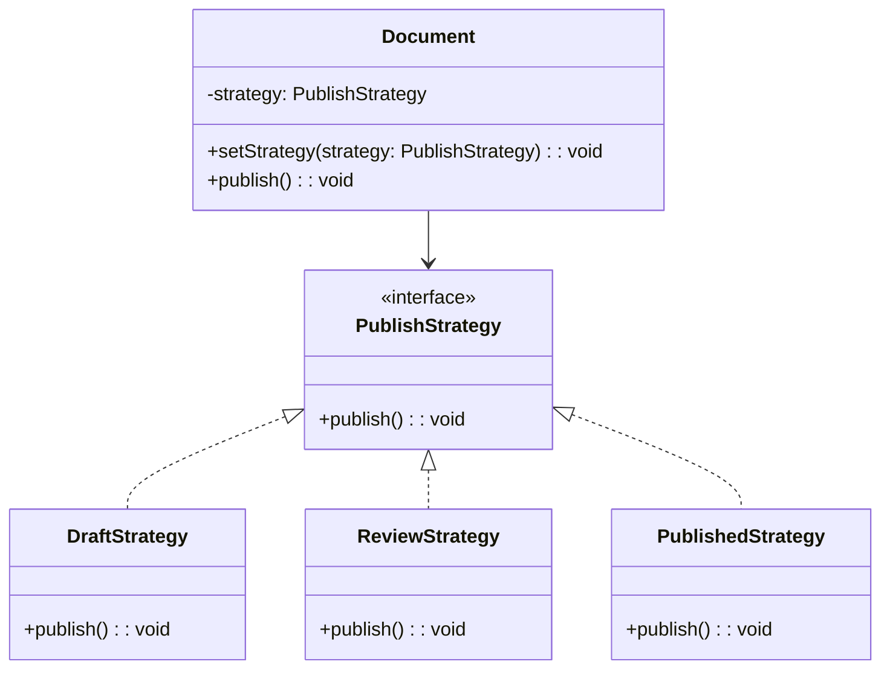

import Tabs from "@theme/Tabs";
import TabItem from "@theme/TabItem";
import CodeBlock from "@theme/CodeBlock";

import tsCode from "@site/src/codes/single-state-handling/ts/rfc_strategy.ts";
import phpCode from "@site/src/codes/single-state-handling/php/rfc_strategy.php";
import pyCode from "@site/src/codes/single-state-handling/py/rfc_strategy.py";

# 🧩 Strategy パターン

## ✅ 設計意図

- 状態ではなく、**外部から差し替える「戦略」として振る舞いを扱う**
- 状態遷移の管理は外部で実装される

## ✅ 適用理由

- 状態と振る舞いを完全に分離したい場合に有効
- 「振る舞いの切り替え」に集中したい場合はこちら

## ✅ 向いているシーン

- 状態管理そのものが不要で、**ただ処理だけ差し替えたいとき**

## ✅ コード例

<Tabs groupId="language">
  <TabItem value="ts" label="TypeScript">
    <CodeBlock language="ts">{tsCode}</CodeBlock>
  </TabItem>
  <TabItem value="php" label="PHP">
    <CodeBlock language="php">{phpCode}</CodeBlock>
  </TabItem>
  <TabItem value="python" label="Python">
    <CodeBlock language="python">{pyCode}</CodeBlock>
  </TabItem>
</Tabs>

## ✅ 解説

このコードは `Strategy` パターン を使用して、ドキュメントの公開処理を戦略（`PublishStrategy`）として分離し、
動的に切り替えられる設計を実現している。`Strategy` パターンは、アルゴリズムや処理をクラスとして分離し、動的に切り替え可能にするデザインパターン。

### 1. Strategy パターンの概要

- **Strategy**: 共通のインターフェースを定義し、異なるアルゴリズムを統一的に扱う
  - このコードでは `PublishStrategy` が該当
- **ConcreteStrategy**: `Strategy` を実装し、具体的なアルゴリズムを提供する
  - このコードでは `DraftStrategy`, `ReviewStrategy`, `PublishedStrategy` が該当
- **Context**: `Strategy` を利用するクラスで、具体的なアルゴリズムを動的に切り替える
  - このコードでは `Document` が該当

### 2. 主なクラスとその役割

- `PublishStrategy`
  - 公開処理の共通インターフェース
  - `publish(): void` メソッドを定義
- `DraftStrategy`, `ReviewStrategy`, `PublishedStrategy`
  - `PublishStrategy` を実装した具体的な戦略クラス
  - 各クラスで異なる公開処理を提供
  - `DraftStrategy`: 「レビュー依頼を送信」
  - `ReviewStrategy`: 「公開しました」
  - `PublishedStrategy`: 「すでに公開済みです」
- `Document`
  - `Context` クラス
  - コンストラクタで `PublishStrategy` を受け取り、`publish` メソッドで現在の戦略に応じた処理を実行
  - `setStrategy` メソッドで戦略を動的に切り替え可能

### 3. UML クラス図

### 4. Strategy パターンの利点

- **柔軟性**: 戦略を動的に切り替えることで、異なる処理を簡単に適用可能
- **単一責任の原則**: 各戦略が独立したクラスに分離されており、保守性が高い
- **拡張性**: 新しい戦略を追加する場合も、`PublishStrategy` を実装するだけで対応可能

この設計は、アルゴリズムや処理を柔軟に切り替える必要がある場面で非常に有効であり、コードの拡張性と保守性を向上させる。
