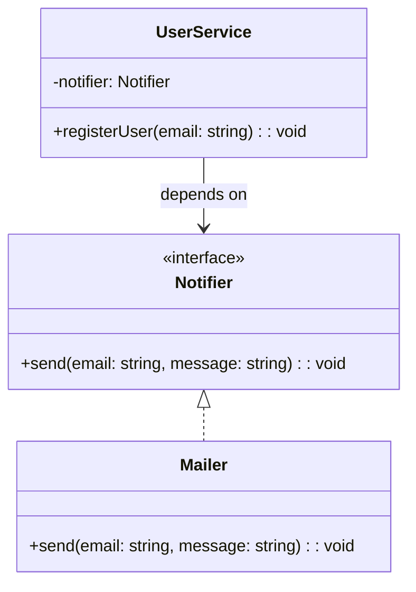

import Tabs from "@theme/Tabs";
import TabItem from "@theme/TabItem";
import CodeBlock from "@theme/CodeBlock";

import tsCode from "@site/src/codes/tight-coupling/ts/rfc_di.ts";
import phpCode from "@site/src/codes/tight-coupling/php/rfc_di.php";
import pyCode from "@site/src/codes/tight-coupling/py/rfc_di.py";

# 🧩 DI パターン

## ✅ 設計意図

- 依存オブジェクトを内部で生成せず、**外部から渡してもらう**
- 「誰を使うか」を決める責務を**外に出すことで**柔軟性 UP

## ✅ 適用理由

- テスト時に**モックやスタブに簡単に差し替え可能**
- サービスの構成変更が**実装を触らずにできる**

## ✅ 向いているシーン

- DI コンテナが使えるアプリケーション構成
- クラスの**依存関係を明示的に管理したい**とき

## ✅ コード例

<Tabs groupId="language">
  <TabItem value="ts" label="TypeScript">
    <CodeBlock language="ts">{tsCode}</CodeBlock>
  </TabItem>
  <TabItem value="php" label="PHP">
    <CodeBlock language="php">{phpCode}</CodeBlock>
  </TabItem>
  <TabItem value="python" label="Python">
    <CodeBlock language="python">{pyCode}</CodeBlock>
  </TabItem>
</Tabs>

## ✅ 解説

このコードは `Dependency Injection (DI)` を使用して、`UserService` が依存する `Notifier` を外部から注入する設計を実現している。
`DI` は、クラスが直接依存先を生成せず、外部から依存先を提供することで、疎結合を実現する設計パターン。

### 1. Dependency Injection の概要

- **Interface**: 依存先の共通インターフェースを定義し、依存先を抽象化。
  - このコードでは `Notifier` が該当。
- **Concrete Implementation**: `Interface` を実装した具体的な依存先。
  - このコードでは `Mailer` が該当。
- **Client**: `Interface` に依存し、具体的な実装を外部から注入されるクラス。
  - このコードでは `UserService` が該当。

### 2. 主なクラスとその役割

- `Notifier`
  - 依存先の共通インターフェース。
  - `send(email: string, message: string): void` メソッドを定義。
- `Mailer`
  - `Notifier` を実装した具体的なクラス。
  - メール送信処理を実行。
- `UserService`
  - クライアントクラス。
  - コンストラクタで `Notifier` を受け取り、ユーザー登録処理を行った後に通知を送信。

### 3. UML クラス図

### 4. Dependency Injection の利点

- **疎結合**: クライアントクラス（`UserService`）が具体的な実装（`Mailer`）に依存しないため、依存先を簡単に差し替え可能。
- **テスト容易性**: モックやスタブを注入することで、ユニットテストが容易になる。
- **拡張性**: 新しい通知方法（例: SMS 通知）を追加する場合も、`Notifier` を実装するだけで対応可能。

この設計は、依存関係を外部から注入することで、コードの柔軟性と保守性を向上させる。特に、依存先が変更される可能性がある場合や、
テスト容易性を向上させたい場合に有効である。
