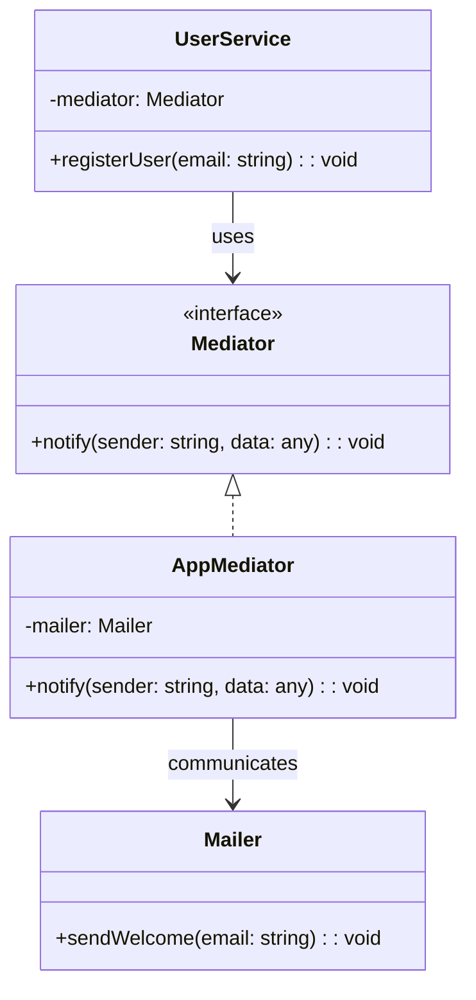

import Tabs from "@theme/Tabs";
import TabItem from "@theme/TabItem";
import CodeBlock from "@theme/CodeBlock";

import tsCode from "@site/src/codes/tight-coupling/ts/rfc_mediator.ts";
import phpCode from "@site/src/codes/tight-coupling/php/rfc_mediator.php";
import pyCode from "@site/src/codes/tight-coupling/py/rfc_mediator.py";

# 🧩 Mediator パターン

## ✅ 設計意図

- 各コンポーネントが**Mediator（調停役）を通じて通信**
- 双方向の依存を 1 箇所に集約し、**関係性を管理しやすくする**

## ✅ 適用理由

- 複数の処理を制御する**中心的な役割を持つクラスを作りたい**場合に有効
- 各コンポーネントの**独立性を保ちつつ連携**が可能

## ✅ 向いているシーン

- 複数コンポーネントの関係を制御したい UI、フォーム、サービス間連携など
- 全体の**流れや制御を見える化したい**とき

## ✅ コード例

<Tabs groupId="language">
  <TabItem value="ts" label="TypeScript">
    <CodeBlock language="ts">{tsCode}</CodeBlock>
  </TabItem>
  <TabItem value="php" label="PHP">
    <CodeBlock language="php">{phpCode}</CodeBlock>
  </TabItem>
  <TabItem value="python" label="Python">
    <CodeBlock language="python">{pyCode}</CodeBlock>
  </TabItem>
</Tabs>

## ✅ 解説

このコードは `Mediator` パターン を使用して、複数のコンポーネント（`UserService` と `Mailer`）間の直接的な依存関係を排除し、
`Mediator` を介して通信する設計を実現している。`Mediator` パターンは、オブジェクト間の通信を仲介者（`Mediator`）に委譲することで、
オブジェクト同士の結合度を低くするデザインパターン。

### 1. Mediator パターンの概要

- **Mediator**: コンポーネント間の通信を仲介するインターフェース
  - このコードでは `Mediator` が該当
- **ConcreteMediator**: `Mediator` を実装し、具体的な通信ロジックを提供するクラス
  - このコードでは `AppMediator` が該当
- **Colleague**: `Mediator` を利用して通信するコンポーネント
  - このコードでは `UserService` と `Mailer` が該当

### 2. 主なクラスとその役割

- `Mediator`
  - コンポーネント間の通信を仲介するインターフェース
  - `notify(sender: string, data: any): void` メソッドを定義
- `AppMediator`
  - `Mediator` の具体的な実装
  - `notify` メソッドで、送信元（`UserService`）からの通知を受け取り、適切なコンポーネント（`Mailer`）に処理を委譲
- `UserService`
  - `Colleague` の 1 つ
  - ユーザー登録処理を行い、`Mediator` を介して他のコンポーネントに通知
- `Mailer`
  - `Colleague` の 1 つ
  - `Mediator` からの通知を受け取り、メール送信処理を実行

### 3. UML クラス図

### 4. Mediator パターンの利点

- **疎結合**: コンポーネント間の直接的な依存関係を排除し、`Mediator` を介して通信することで結合度を低減
- **拡張性**: 新しいコンポーネントを追加する場合も、`Mediator` に処理を追加するだけで対応可能
- **集中管理**: 通信ロジックを `Mediator` に集約することで、コードの可読性と保守性が向上

この設計は、複数のコンポーネントが相互に通信する必要がある場面で非常に有効であり、コードの拡張性と保守性を向上させる。
