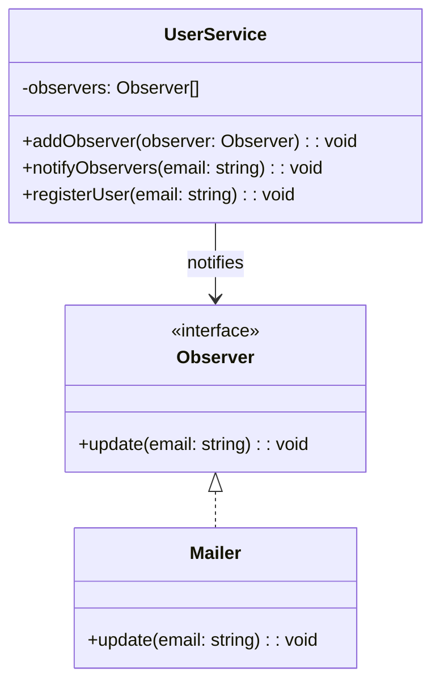

import Tabs from "@theme/Tabs";
import TabItem from "@theme/TabItem";
import CodeBlock from "@theme/CodeBlock";

import tsCode from "@site/src/codes/tight-coupling/ts/rfc_observer.ts";
import phpCode from "@site/src/codes/tight-coupling/php/rfc_observer.php";
import pyCode from "@site/src/codes/tight-coupling/py/rfc_observer.py";

# 🧩 Observer パターン

## ✅ 設計意図

- イベントを発火するだけで、誰がそれに反応するかを知らない
- **処理の追加・変更が容易**（リスナーの追加だけで OK）

## ✅ 適用理由

- 通知先を**動的に追加・差し替え**可能
- 処理ごとにクラスを分離でき、**テスト・再利用性が高い**

## ✅ 向いているシーン

- イベントの発生とその反応処理を分離したいとき
- 拡張や通知の追加が今後も増える場合

## ✅ コード例

<Tabs groupId="language">
  <TabItem value="ts" label="TypeScript">
    <CodeBlock language="ts">{tsCode}</CodeBlock>
  </TabItem>
  <TabItem value="php" label="PHP">
    <CodeBlock language="php">{phpCode}</CodeBlock>
  </TabItem>
  <TabItem value="python" label="Python">
    <CodeBlock language="python">{pyCode}</CodeBlock>
  </TabItem>
</Tabs>

## ✅ 解説

このコードは `Observer` パターン を使用して、`UserService`（通知元）が複数の `Observer`（通知先）に対してイベントを通知する設計を実現している。
`Observer` パターンは、オブジェクト間の 1 対多の依存関係を定義し、1 つのオブジェクトの状態が変化した際に、依存するすべてのオブジェクトに通知を送るデザインパターン。

### 1. Observer パターンの概要

- **Subject**: 通知元となるオブジェクト。`Observer` を登録・削除し、イベント発生時に通知を送る
  - このコードでは `UserService` が該当
- **Observer**: 通知を受け取るオブジェクトのインターフェース
  - このコードでは `Observer` が該当
- **ConcreteObserver**: `Observer` を実装し、通知を受け取った際の具体的な処理を定義
  - このコードでは `Mailer` が該当

### 2. 主なクラスとその役割

- `Observer`
  - 通知を受け取るための共通インターフェース
  - `update(email: string): void` メソッドを定義
- `Mailer`
  - Observer を実装した具体的な通知先
  - `update` メソッドで通知を受け取り、メール送信処理を実行
- `UserService`
  - 通知元（`Subject`）
  - `addObserver` メソッドで `Observer` を登録
  - `notifyObservers` メソッドで登録されたすべての `Observer` に通知を送信
  - `registerUser` メソッドでユーザー登録処理を行い、通知を送信

### 3. UML クラス図

### 4. Observer パターンの利点

- **疎結合**: `Subject` と `Observer` が疎結合であるため、`Observer` を追加・削除しても `Subject` に影響を与えない
- **拡張性**: 新しい `Observer` を追加する場合も、`Observer` インターフェースを実装するだけで対応可能
- **リアルタイム通知**: 状態の変化をリアルタイムで通知可能

この設計は、イベント駆動型のシステムや、複数のオブジェクトに対して状態変化を通知する必要がある場面で非常に有効であり、
コードの拡張性と保守性を向上させる。
